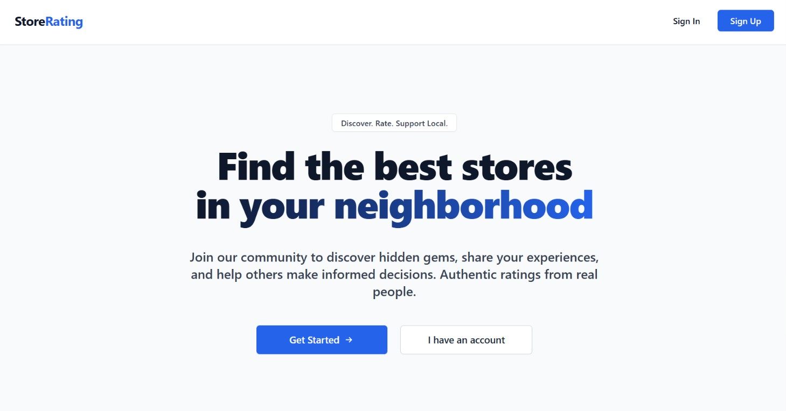
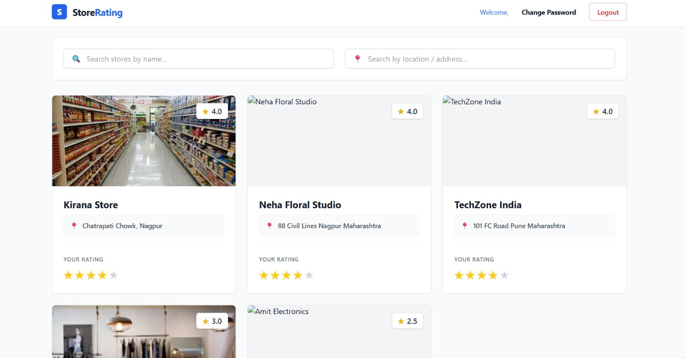
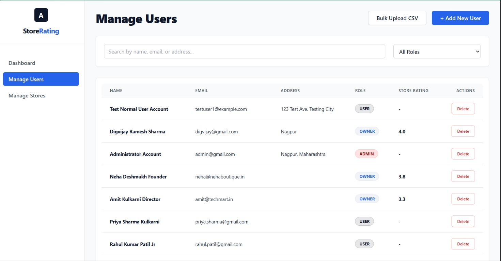
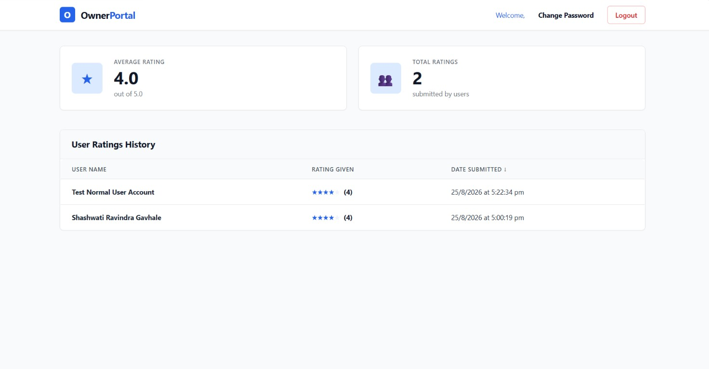

# Store Rating Platform

A full-stack web application designed for a FullStack Intern Coding Challenge. This platform allows users to submit ratings for registered stores and provides distinct, role-based dashboards for System Administrators, Store Owners, and Normal Users.

## 🚀 Tech Stack
- **Frontend**: React.js, Tailwind CSS, React Router
- **Backend**: Node.js, Express.js
- **Database**: PostgreSQL (via `pg` module)
- **Authentication**: JWT (JSON Web Tokens) & bcryptjs

## 📸 Screenshots

| Home Page | User Dashboard |
| :---: | :---: |
|  |  |

| Admin Dashboard | Owner Dashboard |
| :---: | :---: |
|  |  |

## 👥 User Roles & Features

### 1. System Administrator
- Full access to manage the platform.
- View overall statistics (total users, total stores, total ratings).
- Add new users (Admin, Owner, User) and manage existing accounts.
- Bulk upload users and stores via CSV.
- Assign Store Owners to specific stores.
- Filter, search, and sort through all system data.

### 2. Store Owner
- Access to a specialized dashboard displaying analytics for their assigned stores.
- View a detailed history of all users who have rated their store.
- Monitor their store's overall average rating.

### 3. Normal User
- Ability to browse and search the complete directory of registered stores.
- Submit a 1-to-5 star rating for any store.
- Strict "Rate Once" policy enforcement (subsequent ratings update the existing record).
- Update personal account password.

---

## 🛠️ Local Development Setup

### 1. Database Configuration
1. Create a PostgreSQL database.
2. Navigate to the `backend/` directory and configure your `.env` file:
   ```env
   PORT=5000
   DB_USER=postgres
   DB_HOST=localhost
   DB_NAME=store_rating_db
   DB_PASSWORD=your_password
   DB_PORT=5432
   JWT_SECRET=your_jwt_secret_key
   ```
3. The database schema will automatically build and seed the admin user when the server starts.

### 2. Running the Application
From the root directory, install all dependencies:
```bash
# Install root, frontend, and backend dependencies
npm install
cd frontend && npm install
cd ../backend && npm install
```

Start the development servers:
```bash
# Terminal 1: Backend Server (runs on port 5000)
cd backend
npm run dev

# Terminal 2: Frontend Server (runs on port 3000)
cd frontend
npm start
```

---

## 🔐 Default Admin Credentials
When the backend server starts, it automatically provisions a default System Administrator account if one does not already exist.

You can log in to the platform at `http://localhost:3000/login` using:

- **Email**: `admin@gmail.com`
- **Password**: `Admin@123`
